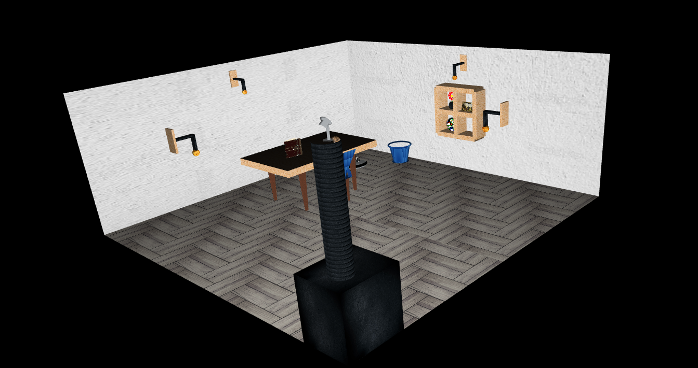
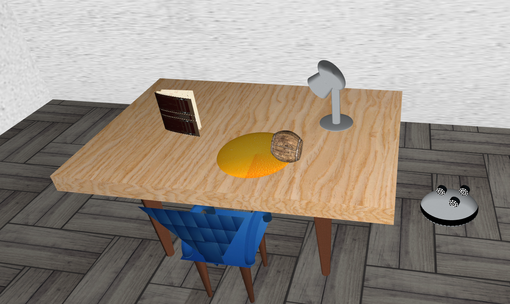
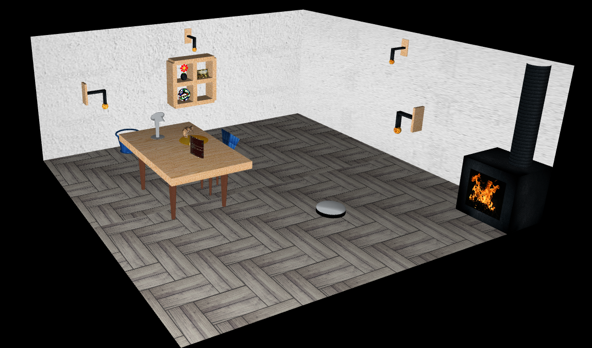

# SGI 2022/2023 - TP2

## Group: T06G01

| Name             | Number    | E-Mail             |
| ---------------- | --------- | ------------------ |
| Carlos Gomes         | 201906622 | 201906622@edu.fe.up.pt|
| Luís Lucas         | 201904624 |   201904624@edu.fe.up.pt              |

----
## Project information

-  In addition to the strong points of the first part of this project, in this second assignment one of our best implementations were the NURBS. We use it for the required primitives and to draw the petals of a flower. Another strong point was the implementation of the shaders in which we could preserve not only the texture but also the material from the start point of the object, even when the 'M' key is pressed to change materials. In other words, when the pulse comes back to 'normal' the fragment shader is capable of showing the original object material and texture and when the 'M' key is pressed those changes are applied to the object.
- Scene
  - Comparing this scene with the one from TP1 we added an animated vaccum robot, a flower and the respective vase (barrel), a book (tent), a wood beer mug (barrel) and we changed our wall primitives from the previous 'MyRectangle' to the rectangle using 'MyPatch'.
  - 
----
## Issues/Problems

- Our biggest issue was the implementation of the keyframe animations in which in the beginning we weren't able to produce any movement, even with the classes and methods already created. With some debugging we were capable of overcome this problem

## Screenshots
### Screenshot 1

### Screenshot 2

### Screenshot 3
